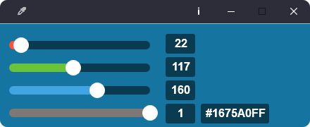
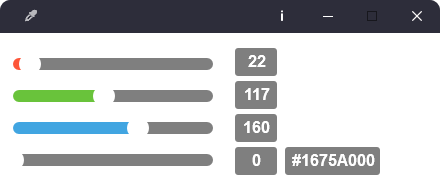

<h1 align="center">
  <a href="https://github.com/girkovarpa/pippette">
    
    
Pippette

  </a>
</h1>

<h2 align="center">Minimalist color picker.</h2>
<h5 align="center"><i>Lightweight remake of <a href="https://github.com/Toinane/colorpicker">Colorpicker</a></i></h5>

<h1 align="center">
  </a>  
  </a>  
</h1>

## Description

**Pippette** is an (almost) featureless color picker.

## Dependencies

- [sciter.dll](https://gitlab.com/sciter-engine/sciter-js-sdk/-/blob/f149f104dcd7fd0db6ca8157acce10f060f03afc/bin/windows/x32/sciter.dll) v4.4.8.38